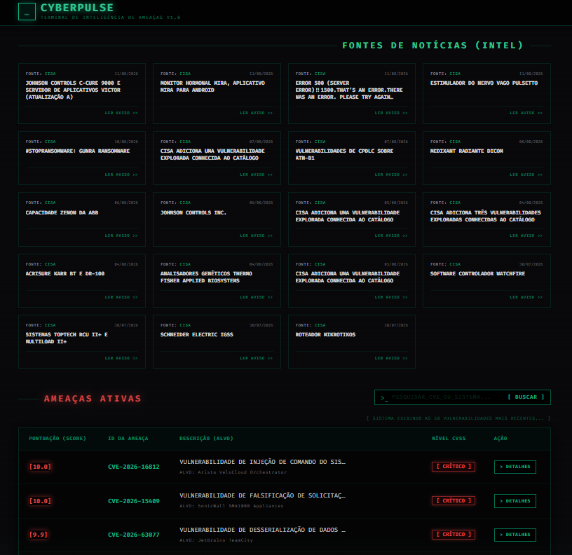
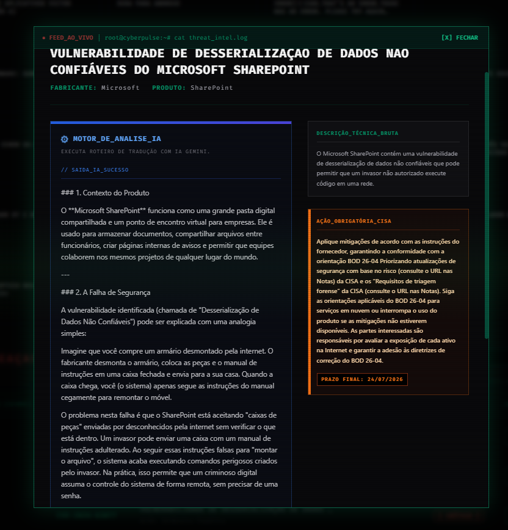
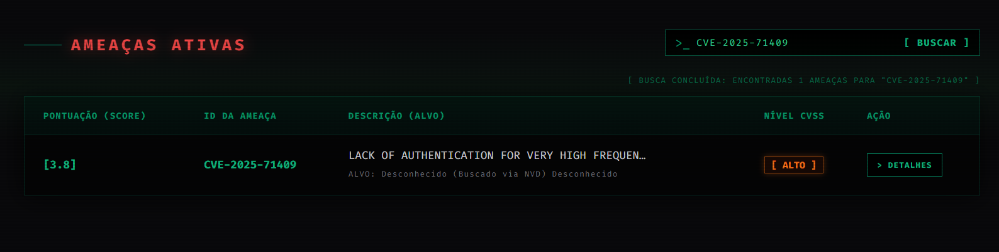

# CyberPulse - Terminal de Inteligência de Ameaças 🛡️


> Um agregador de inteligência de ameaças em tempo real construído com estética Hacker/Cyberpunk. Monitoramento global, pontuação de risco customizada e análise de vulnerabilidades alimentada por Inteligência Artificial (Gemini).

## ⚡ Recursos Principais

- **Feed de Notícias (INTEL):** Captura avisos de segurança de grandes fornecedores em tempo real.
- **Score Customizado (Risk Engine):** Esqueça a ordem cronológica. O CyberPulse calcula o risco real combinando a nota do NVD (CVSS), alertas da CISA (falhas ativamente exploradas) e a data de descobrimento.
- **Integração Real-Time NVD:** Pesquisou por um CVE que não está no banco? O sistema conecta ativamente com a base do governo americano, baixa e processa o dado na mesma hora.
- **Motor de Análise por IA:** Traduz descrições difíceis e ações da CISA para uma linguagem acessível e prática. Segue um padrão de segurança máxima (Zero-Trust para Tokens).
- **Estética Cyber-Dark:** Terminal retrô com fontes mono-espaçadas, CRT scanlines, e alto contraste neon.

---

## 📸 Screenshots da Plataforma







---

## 🛠️ Arquitetura Técnica

* **Backend:** FastAPI (Python), SQLAlchemy, PostgreSQL, APScheduler (Background Jobs).
* **Frontend:** React, TypeScript, TailwindCSS.
* **Inteligência Artificial:** Google Gemini (`gemini-3.5-flash`).
* **Tradução:** Deep Translator (PT-BR).
* **Deploy:** Docker & Docker Compose.

---

## 🚀 Como Executar o Projeto

O projeto foi empacotado para rodar com o mínimo de esforço utilizando Docker.

### Pré-requisitos
* [Docker Desktop](https://www.docker.com/products/docker-desktop/) ou Docker Engine instalado.
* Git.

### Passo 1: Clonar e Iniciar
```bash
# Clone o repositório
git clone https://github.com/SEU-USUARIO/cyberpulse.git
cd cyberpulse

# Suba todos os containers (Banco de Dados, Backend e Frontend)
docker compose up -d --build
```

### Passo 2: Acessar a Plataforma
Pronto! Com o comando acima os robôs de coleta já começaram a popular seu banco de dados local.
Abra seu navegador e acesse:
👉 **[http://localhost:5173](http://localhost:5173)**

---

## 🧠 Como Configurar a IA (Google Gemini)

Pensando em **Segurança Absoluta**, o CyberPulse não armazena chaves de API no servidor (evitando vazamentos e cobranças indevidas). 
Para usar a Inteligência Artificial:

1. Acesse o [Google AI Studio](https://aistudio.google.com/app/apikey) e gere uma **API Key Gratuita**.
2. Abra o painel do CyberPulse (`http://localhost:5173`).
3. Clique em uma vulnerabilidade (em Ameaças Ativas).
4. No quadro da Inteligência Artificial, cole seu Token e clique em **SALVAR**.
5. O Token ficará salvo localmente no seu próprio navegador e será usado com segurança a cada chamada de análise.

---

## 🔐 Segurança e Boas Práticas (Devs)

- O arquivo `.env` está explicitamente no `.gitignore` para evitar vazamentos de configurações de banco de dados.
- O Token da IA trafega diretamente do cliente para o provedor, sem passar por armazenamento em banco de dados (`Zero-Trust`).

---
Desenvolvido como projeto de Inteligência de Segurança e Monitoramento Ativo.
